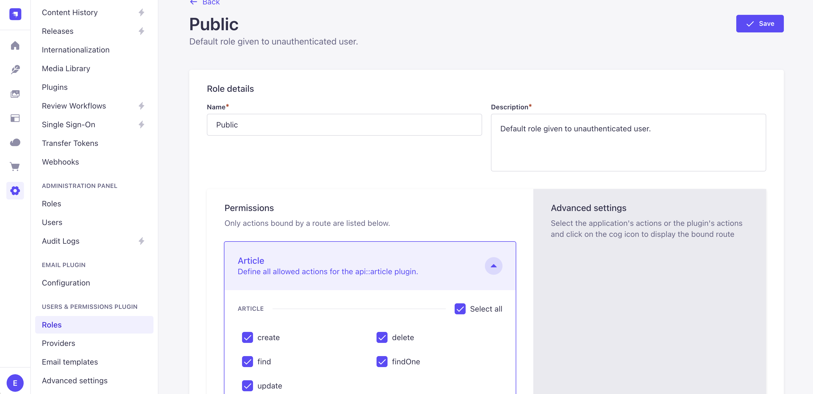

# WIP - Currently a basic headless CMS setup for Strapi and AstroJS.

Once Strapi is initialized you will need to setup a few Collection Types under Content-Type Builder (Article, Author, Category).
Follow the screenshots below for field types. 


After the Content-Types are set, go ahead and create a couple test articles in Strapi.

Then open permissions under settings->users&permissions->roles->public. Select all under articles, category, author.



CD into both backend & frontend directories and run

```
npm run dev
```


